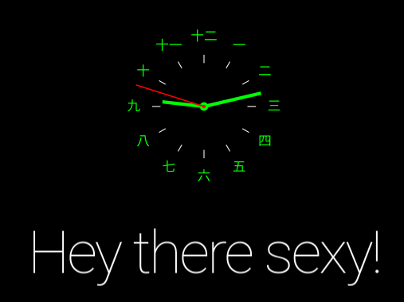

## MMM-Clockinese

Analog clock with Chinese numbers

## Examples

## Installation

* `git clone https://github.com/mykle1/MMM-Clockinese` into the `~/MagicMirror/modules` directory.

## Config.js entry and options

    {
           disabled: false,
           module: 'MMM-Clockinese',
           position: 'top_center',
    },

Felt like making a clock module that was a little different.
I really like the Chinese numbers so that's what I went with.